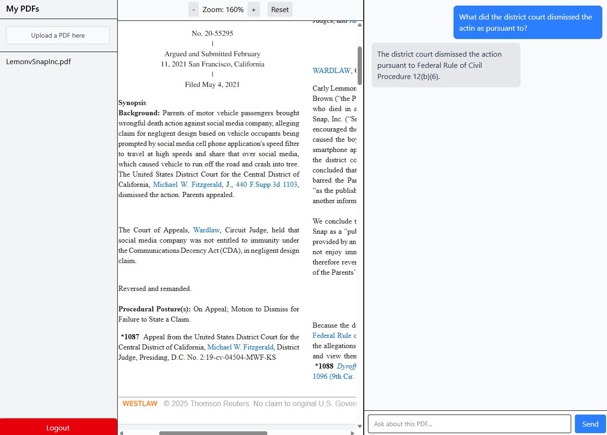

# RAG PDF

## Description 

RAG PDF is an AI powered PDF assistant that allows users to upload PDFs and interact with their contents through natural chats.

The app leverages a modern stack chosen for speed of development, scalability, and ease of deployment:

* Firebase → Quick, reliable user authentication with minimal boilerplate.

* Firestore → Stores PDF metadata.

* Firebase Storage → Seamless file storage for uploaded PDFs.

* Qdrant → Specialized vector database, ideal for scalable semantic search and comes with a generous free tier.

* OpenAI API → High-quality embeddings and chat completions.

* Backend: Express + Typescript, deployed on *Render* for simplicity and stability

* Frontend: React + Typescript + Vite deployed on *Vercel*

## Instalation

The app is deployed and ready to use. For local development:

1. Clone the repository
``` bash
git clone git@github.com:fabricioGuac/RAG-PDF.git

cd RAG-PDF
```

2. Intall dependencies
``` bash

npm install

```

3. Set enviroment variables
    Create a .env file (see server/config/env.ts for required variables) and add your keys for: 

    * OpenAI
    * Firebase
    * Qdrant (if not using Docker locally)

4. Run Qdrant locally with Docker (if not using a cloud instance)

``` bash

docker pull qdrant/qdrant

docker run -p 6333:6333 -p 6334:6334 \
  -v "$(pwd)/qdrant_storage:/qdrant/storage:z" \
  qdrant/qdrant

```
5. Start the project locally

```
npm run dev

```

## Usage

1. Create an account or log in using Firebase Authentication.
2. Upload a PDF via the sidebar.
3. Open the PDF once it is added to the sidebar.
4. Read the PDF in the integrated PDF reader while chatting with the AI assistant side by side.
5. Ask questions about the PDF content in the chat interface.
6. The app returns answers based on the PDF content using embeddings and OpenAI.


## Screenshot displaying the deployed app



## URL to the deployed app

[Rag PDF deployed link](https://rag-pdf-psi.vercel.app/)

## License

MIT License

Copyright (c) 2024 fabricioGuac

Permission is hereby granted, free of charge, to any person obtaining a copy
of this software and associated documentation files (the "Software"), to deal
in the Software without restriction, including without limitation the rights
to use, copy, modify, merge, publish, distribute, sublicense, and/or sell
copies of the Software, and to permit persons to whom the Software is
furnished to do so, subject to the following conditions:

The above copyright notice and this permission notice shall be included in all
copies or substantial portions of the Software.

THE SOFTWARE IS PROVIDED "AS IS", WITHOUT WARRANTY OF ANY KIND, EXPRESS OR
IMPLIED, INCLUDING BUT NOT LIMITED TO THE WARRANTIES OF MERCHANTABILITY,
FITNESS FOR A PARTICULAR PURPOSE AND NONINFRINGEMENT. IN NO EVENT SHALL THE
AUTHORS OR COPYRIGHT HOLDERS BE LIABLE FOR ANY CLAIM, DAMAGES OR OTHER
LIABILITY, WHETHER IN AN ACTION OF CONTRACT, TORT OR OTHERWISE, ARISING FROM,
OUT OF OR IN CONNECTION WITH THE SOFTWARE OR THE USE OR OTHER DEALINGS IN THE
SOFTWARE.

## Questions

If you have any questions or need help with the project, feel free to contact me through the following channels: - Connect with me on GitHub at [fabricioGuac](https://github.com/fabricioGuac)  - Drop me an email at [guacutofabricio@gmail.com](https://github.com/guacutofabricio@gmail.com)   Don't hesitate to reach out if you need any clarifications or want to share feedback. I'm here to assist you!